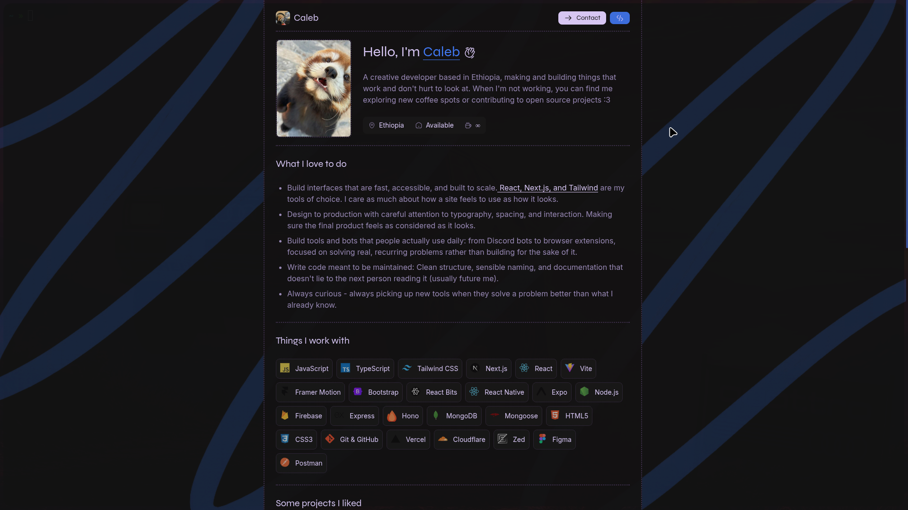

# Portfolio

Welcome to my personal **developer portfolio**, built with **Next.js**, **Tailwind CSS**, **Lens**, **TypeScript**, and a touch of creativity :3

**Live Demo:** [calebephrem.vercel.app](https://calev.pages.dev)

## Preview

## About

This portfolio is a snapshot of who I am as a developer. My style, my craft, and my ongoing evolution.

## Features

- Responsive & fast
- Built with modern tooling
- Minimal & elegant UI
- Minimal animations

## License

© 2026 Caleb Ephrem. Licensed under [MIT License](./LICENSE).

## Connect

If you like my work or want to collaborate, feel free to reach out!

- ⌬ [Portfolio](https://calev.pages.dev)
- ⌬ [GitHub](https://calev.pages.dev/github)
- ⌬ [discord](https://calev.pages.dev/discord)
- ⌬ [X](https://calev.pages.dev/x)
- ⌬ [Email](mailto:calebephrem@proton.me)

> _“Code is poetry written in logic" 🎭_
